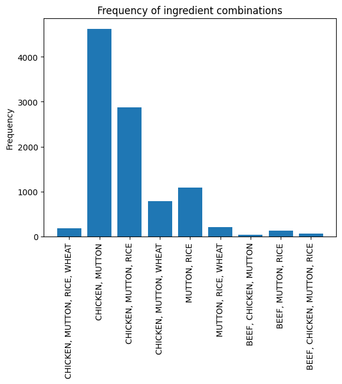
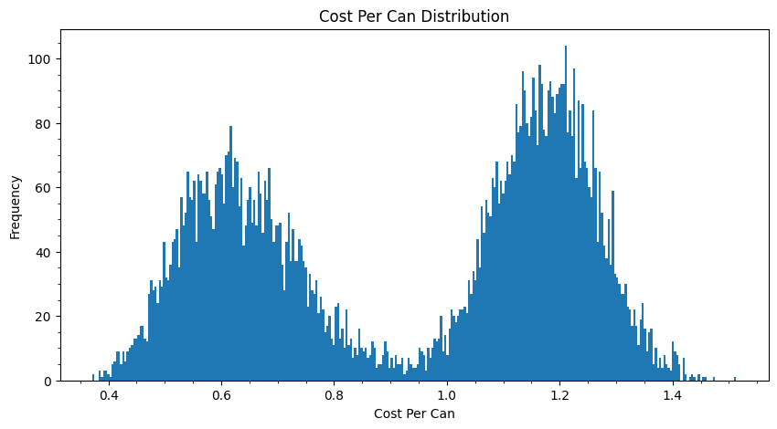
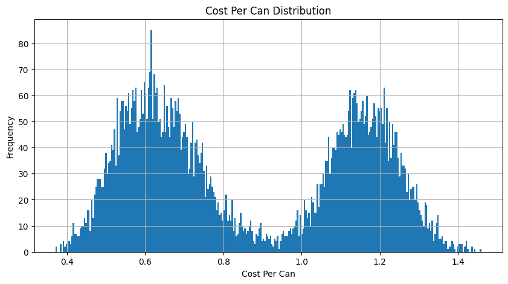
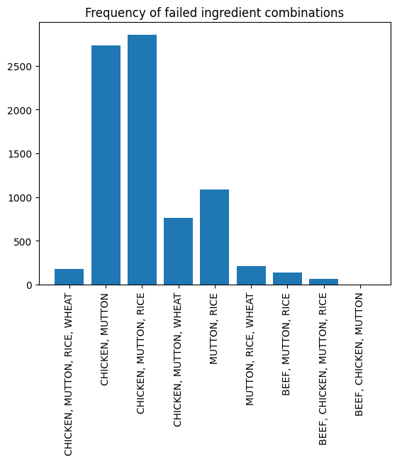
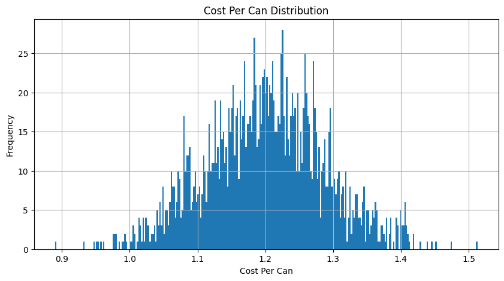
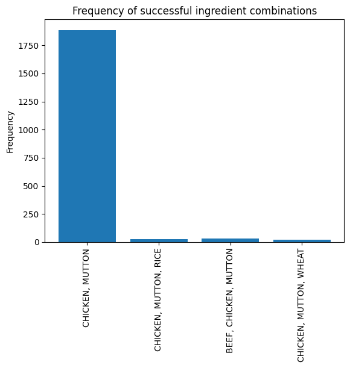

+++
title = 'Blending Optimization'
date = 2024-03-04T22:27:24-06:00
tags = ['data science', 'optimization', 'PuLP', 'python']
+++

# Blending Optimization


Given a set of ingredients with their own costs and nutritional characteristics, how do we obtain the lowest cost mixture that meets our nutritional requirements in 100 grams of the mixture? 
The original form of [this problem](https://coin-or.github.io/pulp/CaseStudies/a_blending_problem.html) is found in [PuLP](https://github.com/coin-or/pulp), a Linear Programming framework written in Python. 
This post is not focused on how to use PuLP; it focuses more on elaborating the problem and obtaining a solution that is robust to real-world conditions.

I also extend this problem by doing a [sensitivity analysis](https://en.wikipedia.org/wiki/Sensitivity_analysis) by using Monte Carlo simulation techniques. 
I first show the original solution, then my extended solution, and lastly, discuss other types of techniques we can use to determine which information is most critical for a low-cost solution. 
In addition to the end result, I showcase some standard ways to program simulations; making it trivial to obtain a multitude of insights.


```python
# import some standard libraries
from pprint import pprint
from pulp import LpProblem, LpMinimize, LpVariable, LpStatus, value, LpInteger, lpSum
import numpy as np

# hide all warnings
import warnings
warnings.filterwarnings('ignore')
```

# Original Problem

Here we have six potential ingredients and four nutritional constraints. 
The unit for cost is dollars (\$) per gram. 
The nutritional values are in grams of that attribute per gram of ingredient. 
Our fifth constraint is that the total percentage of the ingredients equals 100%. 
The problem is almost verbatim the original example, with slight adjustments for readability.


```python
# create the problem object
problem = LpProblem("blending problem", LpMinimize)

# create dictionaries of all the ingredients, their pricepergram, and nutrition
ingredients = ["CHICKEN", "BEEF", "MUTTON", "RICE", "WHEAT", "GEL"]

# price
pricepergram =   { "CHICKEN": 0.013, "BEEF": 0.009, "MUTTON": 0.010, "RICE": 0.002, "WHEAT": 0.005, "GEL": 0.001 }

proteinPercent = { "CHICKEN": 0.100, "BEEF": 0.200, "MUTTON": 0.150, "RICE": 0.000, "WHEAT": 0.040, "GEL": 0.000, }
fatPercent =     { "CHICKEN": 0.080, "BEEF": 0.100, "MUTTON": 0.110, "RICE": 0.010, "WHEAT": 0.010, "GEL": 0.000, }
fibrePercent =   { "CHICKEN": 0.001, "BEEF": 0.005, "MUTTON": 0.003, "RICE": 0.100, "WHEAT": 0.150, "GEL": 0.000, }
saltPercent =    { "CHICKEN": 0.002, "BEEF": 0.005, "MUTTON": 0.007, "RICE": 0.002, "WHEAT": 0.008, "GEL": 0.000, }

# create the variables
ingredient_vars = LpVariable.dicts("Ingr", ingredients, 0)

# Our objective function
problem+=(
    lpSum([pricepergram[ing]*ingredient_vars[ing] for ing in ingredients]), 
    "Total Cost of ingredients per can"
    )

# The five constraints are added to 'prob'
problem+= (lpSum([ingredient_vars[ing] for ing in ingredients]) == 100, "PercentagesSum")
problem+= (
    lpSum([proteinPercent[ing] * ingredient_vars[ing] for ing in ingredients]) >= 8.0,
    "ProteinRequirement",
)
problem+= (
    lpSum([fatPercent[ing] * ingredient_vars[ing] for ing in ingredients]) >= 6.0,
    "FatRequirement",
)
problem+= (
    lpSum([fibrePercent[ing] * ingredient_vars[ing] for ing in ingredients]) <= 2.0,
    "FibreRequirement",
)
problem+= (
    lpSum([saltPercent[ing] * ingredient_vars[ing] for ing in ingredients]) <= 0.4,
    "SaltRequirement",
)


# solve the problem
problem.solve()

assert problem.status == 1, "Optimal solution not found"

# assert the percentage sum is met
assert np.isclose(sum([value(ingredient_vars[ing]) for ing in ingredients]), 100, atol=1e-6), "Percentage sum not met"
# assert the protein requirement is met
assert sum([proteinPercent[ing] * value(ingredient_vars[ing]) for ing in ingredients]) >= 8.0, "Protein requirement not met"
# assert the fat requirement is met
assert sum([fatPercent[ing] * value(ingredient_vars[ing]) for ing in ingredients]) >= 6.0, "Fat requirement not met"
# assert the fibre requirement is met
assert sum([fibrePercent[ing] * value(ingredient_vars[ing]) for ing in ingredients]) <= 2.0, "Fibre requirement not met"
# assert the salt requirement is met
assert sum([saltPercent[ing] * value(ingredient_vars[ing]) for ing in ingredients]) <= 0.4, "Salt requirement not met"


for v in problem.variables():
    print(v.name, "=", v.varValue)
cost = sum([pricepergram[ing] * value(ingredient_vars[ing]) for ing in ingredients])
print("\nThe total cost is $", cost, "per can.")

```

    Ingr_BEEF = 60.0
    Ingr_CHICKEN = 0.0
    Ingr_GEL = 40.0
    Ingr_MUTTON = 0.0
    Ingr_RICE = 0.0
    Ingr_WHEAT = 0.0
    
    The total cost is $ 0.58 per can.
    

You can see here that the optimal combination is 60% Beef and 40% gel giving us only \$0.58 per can.
At face value our problem is solved.
But, if you have any experience with finance you might say "hey, how are we sure the price of the ingredients stay the same?".
And if you're a scientist you might note "those nutritional values are not guaranteed!".
In the next section, I'll do my best to satisfy both curiosities, then talk about how much modeling is appropriate depending on your needs.

# Sensitivity analysis

What I wish to start with is a full blown sensitivity analysis.
Meaning, I will place in some form of random margin on each attribute for each ingredient and see what our answer is then.
More specifically, let's assume that each attribute on each ingredient given by our problem, is the average measured value.
Then we will assume a normal distribution about that value ($\mu=1\times x_{ij}$), with a conservative distribution width of $\sigma=0.1*x_{ij}$ where $x_{ij}$ is the $j$ 'th attribute of the $i$ 'th ingredient.

We will first create a function that will return randomly perturbed attributes of our.


```python
def randomize_attributes(pricepergram={}, proteinPercent={}, fatPercent={}, fibrePercent={}, saltPercent={}) -> tuple[dict]:
    new_pricepergram = {}
    new_proteinPercent = {}
    new_fatPercent = {}
    new_fibrePercent = {}
    new_saltPercent = {}
    for ing in ingredients:
        new_pricepergram[ing] = pricepergram[ing] * np.random.normal(1, 0.1)
        new_proteinPercent[ing] = proteinPercent[ing] * np.random.normal(1, 0.1)
        new_fatPercent[ing] = fatPercent[ing] * np.random.normal(1, 0.1)
        new_fibrePercent[ing] = fibrePercent[ing] * np.random.normal(1, 0.1)
        new_saltPercent[ing] = saltPercent[ing] * np.random.normal(1, 0.1)

    return new_pricepergram, new_proteinPercent, new_fatPercent, new_fibrePercent, new_saltPercent
```

Next, we like to functionize how our problem is solved, that way, we can call it as many times as we want in a readable way.


```python
def solveLP(ingredients, pricepergram={}, proteinPercent={}, fatPercent={}, fibrePercent={}, saltPercent={}) -> LpProblem:

    # create the problem
    prob = LpProblem("Full problem", LpMinimize)

    # create the variables
    ing_vars = LpVariable.dicts("Ingr", ingredients, 0)


    # objective function goes in first
    prob += lpSum([pricepergram[ing]*ing_vars[ing] for ing in ingredients]), "Total Cost of Ingredients per can"

    # the five constraints
    prob += (lpSum([ing_vars[ing] for ing in ingredients]) == 100                       , "PercentagesSum")

    prob += (lpSum([proteinPercent[ing] * ing_vars[ing] for ing in ingredients]) >= 8.0 , "ProteinRequirement")
    prob += (lpSum([fatPercent[ing]     * ing_vars[ing] for ing in ingredients]) >= 6.0 , "FatRequirement")
    prob += (lpSum([fibrePercent[ing]   * ing_vars[ing] for ing in ingredients]) <= 2.0 , "FibreRequirement")
    prob += (lpSum([saltPercent[ing]    * ing_vars[ing] for ing in ingredients]) <= 0.4 , "SaltRequirement")
    prob.solve()


    return prob
```

Now we have a system to create as many problems as we want. 
A critical aspect of conducting simulations is the proper storage of results. 
It's trivial and beneficial to group the inputs and outputs together into one data structure. 
This approach allows us to extract anything we need from a pool of recorded runs.


```python
from dataclasses import dataclass, field

@dataclass
class InputData:
    ingredients: list[str]
    input_tuple: tuple[dict]
    pricepergram: dict[str, float] = field(default_factory=dict)
    proteinPercent: dict[str, float] = field(default_factory=dict)
    fatPercent: dict[str, float] = field(default_factory=dict)
    fibrePercent: dict[str, float] = field(default_factory=dict)
    saltPercent: dict[str, float] = field(default_factory=dict)
    

    def __post_init__(self):
        self.pricepergram = self.input_tuple[0]
        self.proteinPercent = self.input_tuple[1]
        self.fatPercent = self.input_tuple[2]
        self.fibrePercent = self.input_tuple[3]
        self.saltPercent = self.input_tuple[4]


@dataclass
class SimulationRun:
    input_data: InputData

    result: LpProblem

    percent_values: dict[str, float] = field(default_factory=dict)
    ingredients: frozenset[str] = field(default_factory=frozenset)
    cost: float = 0
    protein: float = 0
    fat: float = 0
    fibre: float = 0
    salt: float = 0

    def __post_init__(self, **kwargs):
        # frontload the calculation of all these variables so we don't have overhead when exploring the results

        all_ingredients = self.input_data.ingredients
        self.percent_values = {ing: self.get_ing_value(ing)                           for ing in all_ingredients}
        self.cost =           sum([self.input_data.pricepergram[ing] * self.get_ing_value(ing)   for ing in all_ingredients])
        self.protein =        sum([self.input_data.proteinPercent[ing] * self.get_ing_value(ing) for ing in all_ingredients])
        self.fat =            sum([self.input_data.fatPercent[ing] * self.get_ing_value(ing)     for ing in all_ingredients])
        self.fibre =          sum([self.input_data.fibrePercent[ing] * self.get_ing_value(ing)   for ing in all_ingredients])
        self.salt =           sum([self.input_data.saltPercent[ing] * self.get_ing_value(ing)    for ing in all_ingredients])

        

    def get_ing_value(self, ing):
        return value(self.result.variables()[self.input_data.ingredients.index(ing)])

    def get_ingredients(self):
        from collections import defaultdict

        # get all the combinations of different ingredients that are greater than 0 in percentage
        ing_set = []
        for ing in self.input_data.ingredients:
            if self.percent_values[ing] > 0:
                ing_set.append(ing)
        return frozenset(ing_set)

```


This approach may seem a bit pedantic, but there are benefits to structuring the results this way:

1. It ensures clarity about the contents of the data structures.
2. Accessing attributes using dot (.) notation simplifies the writing process.
3. It enhances functionality through the integration of functions, allowing for more abstracted, useful operations as demonstrated in the above function.

This structure wasn't the initial design but was adopted after several iterations of running simulations, enhancing the ease of exploring the results. 
Next, we will execute the simulation and analyze the outputs.


```python
# save the run to a list

runs = []
for n in range(10000):

    new_attributes = randomize_attributes(
        pricepergram=pricepergram,
        proteinPercent=proteinPercent,
        fatPercent=fatPercent,
        fibrePercent=fibrePercent,
        saltPercent=saltPercent
    )

    prob = solveLP(ingredients, *new_attributes)

    run = SimulationRun(
        result = prob,
        input_data = InputData(ingredients, new_attributes)
    )

    runs.append(run)

```


```python
from collections import defaultdict

# get all the combinations of different ingredients that are greater than 0 in percentage
ing_combos = defaultdict(lambda: 0.0)
for run in runs:
    ing_combos[run.get_ingredients()] += 1


# make a new dictionary with just the ingredients as a combined string and their occurances
ing_combos_str = {", ".join(sorted(k)): v for k, v in ing_combos.items()}
    
```


```python
ing_combos_str
```


    {'CHICKEN, MUTTON, RICE, WHEAT': 180.0,
     'CHICKEN, MUTTON': 4618.0,
     'CHICKEN, MUTTON, RICE': 2877.0,
     'CHICKEN, MUTTON, WHEAT': 788.0,
     'MUTTON, RICE': 1090.0,
     'MUTTON, RICE, WHEAT': 211.0,
     'BEEF, CHICKEN, MUTTON': 36.0,
     'BEEF, MUTTON, RICE': 137.0,
     'BEEF, CHICKEN, MUTTON, RICE': 63.0}


Now we can simply plot to see what our typical optimized ingredients are in most cases.


```python
from matplotlib import pyplot as plt
# plot the ing combos as bars with the number of times they appeared

plt.bar(ing_combos_str.keys(), ing_combos_str.values())
#rotate the x labels by 90 degrees
plt.xticks(rotation=90)
plt.title("Frequency of ingredient combinations")
plt.ylabel("Frequency")
plt.show()
```


    

    


Surprisingly, the most common combination of ingredients in our sensitivity analysis is not beef and gel.
In fact, that combination never shows up when we add some randomness to our values.
The most common is chicken and mutton.
Below shows the prices binned and that there is a bifurcation in the most common price we spend per can.
We can explore some more reasoning behind this conclusion below.


```python
# plot all the costs of the runs on a histogram
fig, ax = plt.subplots(figsize=(10, 5))
prices = [run.cost for run in runs]

ax.hist(prices, bins=300)
ax.minorticks_on()

ax.set_title("Cost Per Can Distribution")
ax.set_xlabel("Cost Per Can")
ax.set_ylabel("Frequency")
plt.show()
```


    

    


There are numerous ways to interpret the data. 
In the following section, I continue the analysis but briefly pause to organize our results into a user-friendly format, specifically dataframes. 
We'll also discover that our solution is not exactly as we initially perceived.

# Analysis

Let's look at the results in greater detail. 
It was easy to store the runs with dataclasses, but they're not that easy to analyze on the fly.
An easier way to work with the data in this case is to flatten it and place it inside a dataframe.

*You might wonder why I didn't just put it in a dataframe in the first place. 
Well the answer to that is that is really just habit. 
In this, our end goal is to stop here and analyze the data so we could do it that way.
However not every simulation architecture is tabular data friendly.
As well, we may want to do more with simulations in a second step.
In that case, trying to work with dataframe cells as data objects is inhumane to the coder.*


Below is a function to transform the run object into a row of data.


```python
def run2row(run):
    ing_set = run.get_ingredients()
    return {
        "cost": run.cost,
        "protein": run.protein,
        "fat": run.fat,
        "fibre": run.fibre,
        "salt": run.salt,

        "has_chicken": "CHICKEN" in ing_set,
        "has_beef": "BEEF" in ing_set,
        "has_mutton": "MUTTON" in ing_set,
        "has_rice": "RICE" in ing_set,
        "has_wheat": "WHEAT" in ing_set,
        "has_gel": "GEL" in ing_set,

        "input_chicken_price": run.input_data.pricepergram["CHICKEN"],
        "input_beef_price": run.input_data.pricepergram["BEEF"],
        "input_mutton_price": run.input_data.pricepergram["MUTTON"],
        "input_rice_price": run.input_data.pricepergram["RICE"],
        "input_wheat_price": run.input_data.pricepergram["WHEAT"],
        "input_gel_price": run.input_data.pricepergram["GEL"],

        "input_chicken_protein": run.input_data.proteinPercent["CHICKEN"],
        "input_beef_protein": run.input_data.proteinPercent["BEEF"],
        "input_mutton_protein": run.input_data.proteinPercent["MUTTON"],
        "input_rice_protein": run.input_data.proteinPercent["RICE"],
        "input_wheat_protein": run.input_data.proteinPercent["WHEAT"],
        "input_gel_protein": run.input_data.proteinPercent["GEL"],
        
        "input_chicken_fat": run.input_data.fatPercent["CHICKEN"],
        "input_beef_fat": run.input_data.fatPercent["BEEF"],
        "input_mutton_fat": run.input_data.fatPercent["MUTTON"],
        "input_rice_fat": run.input_data.fatPercent["RICE"],
        "input_wheat_fat": run.input_data.fatPercent["WHEAT"],
        "input_gel_fat": run.input_data.fatPercent["GEL"],
        
        "input_chicken_fibre": run.input_data.fibrePercent["CHICKEN"],
        "input_beef_fibre": run.input_data.fibrePercent["BEEF"],
        "input_mutton_fibre": run.input_data.fibrePercent["MUTTON"],
        "input_rice_fibre": run.input_data.fibrePercent["RICE"],
        "input_wheat_fibre": run.input_data.fibrePercent["WHEAT"],
        "input_gel_fibre": run.input_data.fibrePercent["GEL"],
        
        "input_chicken_salt": run.input_data.saltPercent["CHICKEN"],
        "input_beef_salt": run.input_data.saltPercent["BEEF"],
        "input_mutton_salt": run.input_data.saltPercent["MUTTON"],
        "input_rice_salt": run.input_data.saltPercent["RICE"],
        "input_wheat_salt": run.input_data.saltPercent["WHEAT"],
        "input_gel_salt": run.input_data.saltPercent["GEL"],

        
        "problem_status": run.result.status,

        "failed_protein": run.protein < 8.0,
        "failed_fat": run.fat < 6.0,
        "failed_fibre": run.fibre > 2.0,
        "failed_salt": run.salt > 0.4,
        "failed_constraints": run.result.status != 1,
        
    }

def get_dataframe(runs):
    import pandas as pd
    return pd.DataFrame([run2row(run) for run in runs])

df = get_dataframe(runs)
```

I've now added some rows at the bottom to validate our constraints and requirements. 
Usually, this might not be considered, but it's wise to verify everything, including your own code. 
Below, I create a plot to examine any result where there was a breach in the requirements.

```python
failed_simulations = df[["failed_protein", "failed_fat", "failed_fibre", "failed_salt", "failed_constraints"]].any(axis=1)

fig, ax = plt.subplots(figsize=(10, 5))
df[failed_simulations]['cost'].hist(bins=300, ax=ax)

ax.set_title("Cost Per Can Distribution")
ax.set_xlabel("Cost Per Can")
ax.set_ylabel("Frequency")
```


    Text(0, 0.5, 'Frequency')


    

    


Unfortunately, there is no rhyme or reason at the moment as to why these constraints were breached.
This could be a fault of my own, or something to do with PuLP.
Regardless, I will exclude these results from future analysis.

I do want to attempt to shed light on why there are failed simulations so let's look at a list of the ingredients in the failed simulations.


```python
# create a list of frozen sets of ingredients that failed the constraints
failed_ingredients = df[failed_simulations]["has_chicken has_beef has_mutton has_rice has_wheat has_gel".split()]

failed_ing_dict = defaultdict(lambda: 0)
for i, ing in failed_ingredients.iterrows():
    # get the name of the ingredient that is in the row
    ing_list = []
    if ing['has_chicken']:
        ing_list.append("CHICKEN")
    if ing['has_beef']:
        ing_list.append("BEEF")
    if ing['has_mutton']:
        ing_list.append("MUTTON")
    if ing['has_rice']:
        ing_list.append("RICE")
    if ing['has_wheat']:
        ing_list.append("WHEAT")
    if ing['has_gel']:
        ing_list.append("GEL")
        
    failed_ing_dict[frozenset(ing_list)] += 1
    

    

    
failed_ing_combos_str = {", ".join(sorted(k)): v for k, v in failed_ing_dict.items()}

from matplotlib import pyplot as plt
# plot the ing combos as bars with the number of times they appeared

plt.bar(failed_ing_combos_str.keys(), failed_ing_combos_str.values())
#rotate the x labels by 90 degrees
plt.xticks(rotation=90)
plt.title("Frequency of failed ingredient combinations")
plt.show()
```


    

    


```python
# check if any of the failed simulations have a run status that is not 1

df[failed_simulations]["problem_status"].value_counts()
```


    problem_status
    1    8034
    Name: count, dtype: int64


This small dive doesn't really tell us anything.
Looking at the problem status, all simulations did come out as fully optimized.
If we really trust PuLP, then it is probably our fault.
But never trust anything so it could be PuLP the way I set up the optimization problem.
Regardless, I will continue my analysis on the simulations that did work.

## Successful Simulations

Below we have the same analysis for the successful simulations.


```python
successful_simulations = ~df[["failed_protein", "failed_fat", "failed_fibre", "failed_salt", "failed_constraints"]].any(axis=1)

fig, ax = plt.subplots(figsize=(10, 5))
df[successful_simulations]['cost'].hist(bins=300, ax=ax)

ax.set_title("Cost Per Can Distribution")
ax.set_xlabel("Cost Per Can")
ax.set_ylabel("Frequency")
plt.show()
```


    

    


```python

# create a list of frozen sets of ingredients that successful the constraints
successful_ingredients = df[successful_simulations]

successful_ing_dict = defaultdict(lambda: 0)
for i, ing in successful_ingredients.reset_index().iterrows():
    # get the name of the ingredient that is in the row
    ing_list = []
    if ing['has_chicken']:
        ing_list.append("CHICKEN")
    if ing['has_beef']:
        ing_list.append("BEEF")
    if ing['has_mutton']:
        ing_list.append("MUTTON")
    if ing['has_rice']:
        ing_list.append("RICE")
    if ing['has_wheat']:
        ing_list.append("WHEAT")
    if ing['has_gel']:
        ing_list.append("GEL")
        
    successful_ing_dict[frozenset(ing_list)] += 1
    


successful_ing_combos_str = {", ".join(sorted(k)): v for k, v in successful_ing_dict.items()}

from matplotlib import pyplot as plt
# plot the ing combos as bars with the number of times they appeared

plt.bar(successful_ing_combos_str.keys(), successful_ing_combos_str.values())
#rotate the x labels by 90 degrees
plt.xticks(rotation=90)
plt.title("Frequency of successful ingredient combinations")
plt.ylabel("Frequency")
plt.show()
```


    

    


```python
# get the average price of the successful runs
df[successful_simulations]["cost"].mean()
```


    1.1999817845800267


Now this result is really surprising in contrast with our original results.
There is no bifurcation in the successful simulations.
Instead we get a single normal distribution which agrees with my gut feeling on the way Monte Carlo's typically work.
And, our most popular ingredient by far is a combination of chicken and mutton at approximately \$1.20 per can.

There are plenty of improvements that can be made to this study:

1. Figure out why some simulations fail.
2. Utilize distributions in nutrients from empirical lab results.
3. Incorporate market movement for ingredient prices. We could use Markov Chains to extrapolate probable prices in the future.

A final note is that, depending on your needs, it's not completely necessary to model fluctuations in both price and nutrient values.
Companies may be able to get away with just adhering to the average value of the nutrient per gram, and just model price fluctuations.
If you're a scientist doing studies on astronaut performance with funding from the government, it may be worth it to model both.

