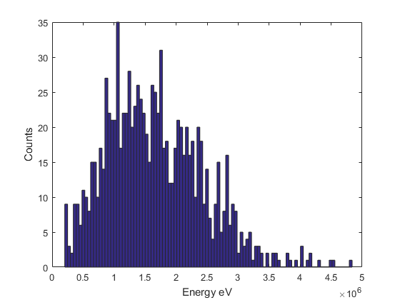
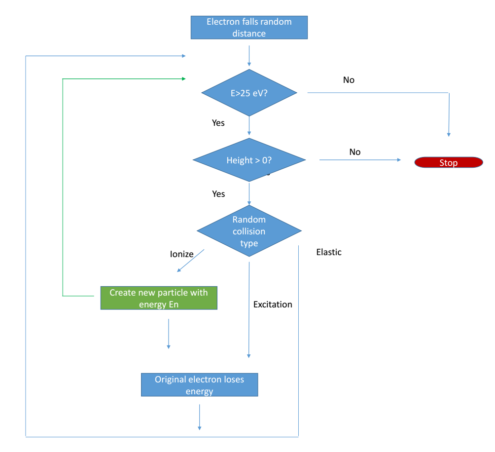
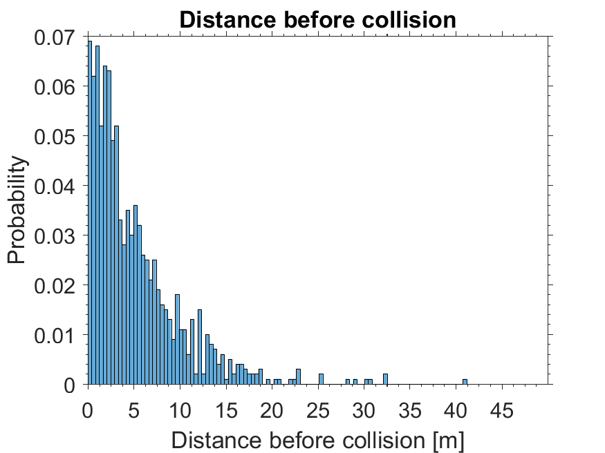
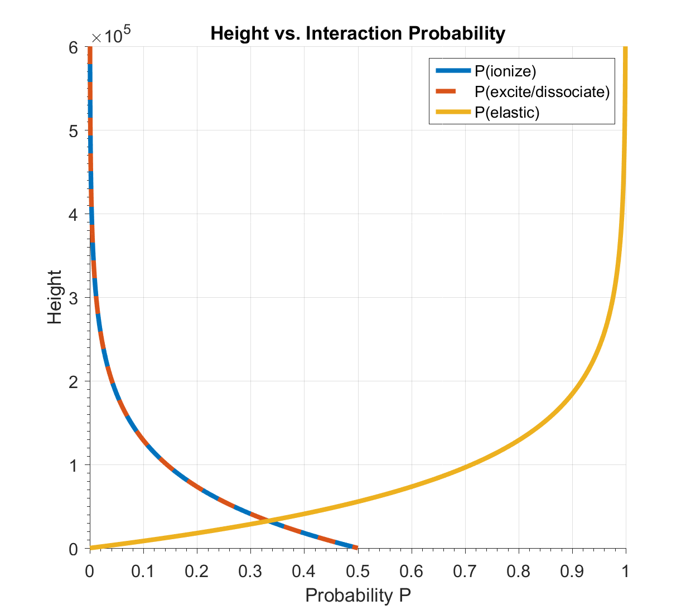
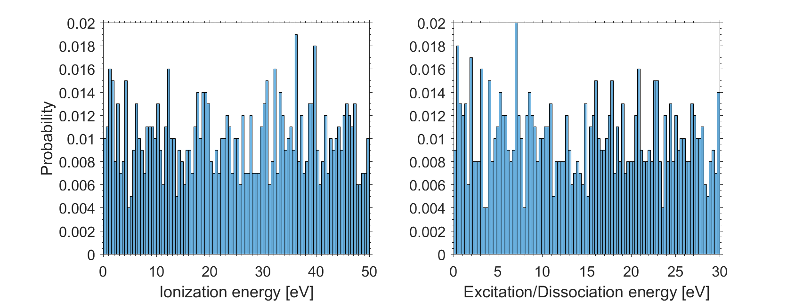
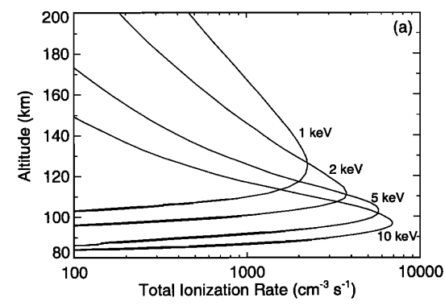
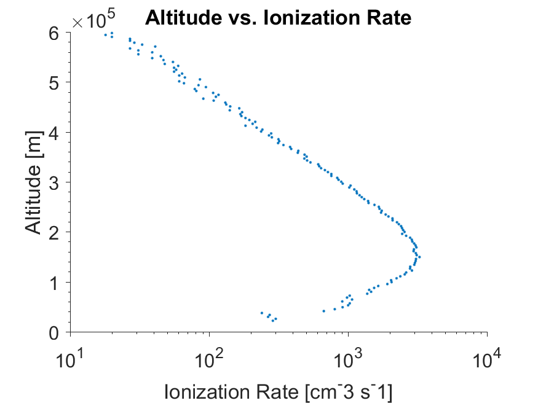
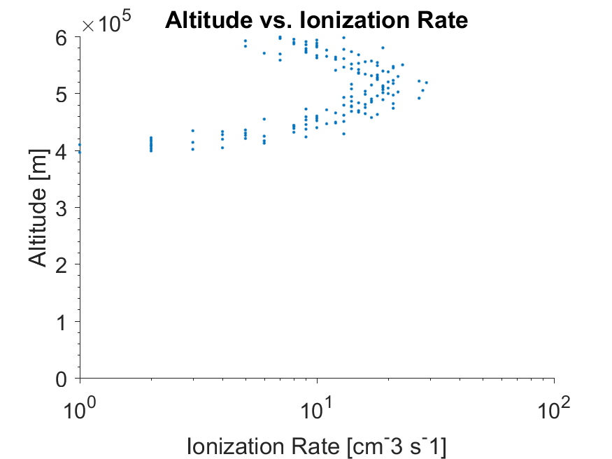
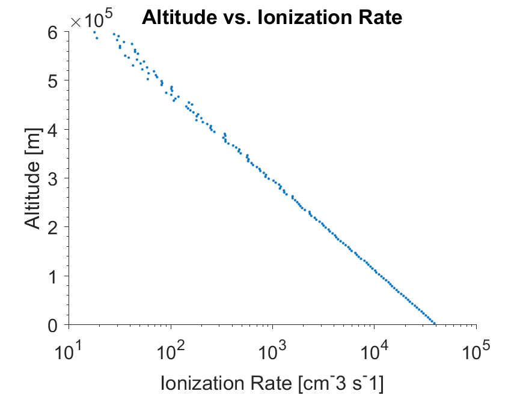

+++
title = 'Ionization Rates in the Atmosphere'
date = 2024-02-29T15:31:15-06:00
tags =  ['academic', 'space science']
+++

# Electron Ionization in the Atmosphere

## 1. Introduction

Understanding the chemistry that controls our atmosphere is import in order to understanding its dynamics and effect on our daily lives. 
One particular chemistry problem is the ionization of neutral particles in the atmosphere. 
This ionization can occur from a number of mechanisms including photoionization, ionization by ions, or ionization by electrons. 
A fully complete model is desired but also beyond the scope of this project. 
A focus on a simple model of the atmosphere is provided along with a basic assumption of the interaction between electrons and the gas they aim to ionize.

Following the work of Solomon [2001], my goal is to use Monte Carlo simulation to produce ionization rates of the proper shape and study how different factors affect the outcome. The factors are looked at qualitatively due to the focus on how the set-up closely produces the desired results. All random variates are produced using MatLab built in random number generators.

## 2. Set-Up

My assumptions for the problem are as follow:
1) The incoming mass and charge of the particles, do not matter in this experiment. The mention of electrons is only due to interest in the original paper, Solomon [1993], which does account for the type of particle. 
2) No magnetic field is present. Although nonphysical, this would only complicate understanding the results. 
3) The seed population, along with further generations of particles, do not interact with each other. Furthermore the structure of the atmosphere is not affected by the experiment. 
4) The atmosphere is an undefined monoatomic neutral gas whose density increases exponentially with decreasing altitude h constrained by a characteristic scale height, H. [Hargreaves 1992]

(1) $$n = n_0 \exp⁡(-h/H)$$

5) The cross section, and therefore the probability of interaction P(A), scales proportionally with the number density of the monoatomic gas. P_0 is the probability at the ground.

(2)	$$P(A)=P_0 \exp⁡(-h/H)$$

To start the experiment I begin with a random distribution of Energy corresponding to the Maxwell-Boltzmann distribution. 

(3)	$$f(E)= 2\sqrt{\frac{E}{\pi}} \left(\frac{1}{kT}\right)^{3/2}  \exp\left(\frac{-E}{kT} \right)$$

This can be simulated by a chi-squared distribution with 3 degrees of freedom [4]. 
This is done by simulating random Gaussians centered about (1/3)2keV with deviation of 250 keV for each energy in a 3xN matrix for N particles and summing their squares. 
All seed particles begin with a height of 600 km. 

From here, each seed particle follows a specific flow of logic to determine how much energy it has, how much energy the next generation of ionized particles have, and so forth. The flow for my method is show below.

In greater detail, the electron falls a random distance, \(\Delta \tau_e= -\log⁡(r) \tau_e\). 
Where $r$ is a random variable from 0 to 1 and $\tau_e$ is the mean free path of the particle which physically will vary with temperature which also changes in the atmosphere. 
To simplify I will crudely and incorrectly assume 5 meters since this gave an answer easily demonstrated. The distribution is shown below.

If the energy is still high enough, E > 25 eV, and the particle has not reached the ground, it will continue onwards to a collision event. The particle may collide in one of three ways.

1. **Elastically collide** - no energy lost, it continues to fall towards Earth.
2. **Excite or Dissociate** - no net particle created but energy is lost and it continues to fall.
3. **Ionize** - a particle is created, energy is lost, and now both fall to continue the same process.

I have grouped excitation and dissociation because although dissociation only exchanges the incoming particle with a new particle of lower energy creating no new particles. 
The chemistry of dissociation is important in a full model but here the effect has been simplified. 
When the particle ionizes, another decision tree is created for the new particle. 
In the program itself, the seed particle, or the 0th generation, will complete its run through the flow chart and until it stops before I begin again with the 1st generation of particles. 
Then it will continue for all 1st gen particles and so forth for their respective Nth generations. 

The scaling probability given by equation 2 is the most important assumption in this project and is applied to both ionization and excitation/dissociation both with P_0=0.5. 
Ellastic collisions are assumed such that,

(4)	$$P(elastic)=1-(P(ionize)+P(excitation/dissociate))$$

The characteristic scale height is set at H=80km which is a decently physical value [Hargreaves, 1992]. The probabilities scale as shown below. 

The energy lost due to the interactions is a randomly isotropically distributed number from 0 to 50 eV and 30 eV for ionization and excitation/dissociation respectively. This is demonstrated below.

## 3. Results and Discussion
Using these assumptions I started with 100 seed particles and was able to obtain a graph with a similar shape as given in Solomon [1993] and Solomon [2001]. 
As done in the paper, we can directly relate the ionization rate to our generated particles by assuming the continuous flux of electrons is exactly our seed population.
	

 
 

Solomon [2001] (top figure above) demonstrates ionization curves for center energies of 1keV, 2keV, 5keV, and 10 keV. 
Some immediately obvious discrepancies are the scales at which peak ionization occurs and the amount of ionization. 
Shifting energies to say 1 or 3 keV follow a similar trend although with less fidelity.

For a Mawell-Boltzmann seed population focused around 1keV, the energy produces a weaker shape at a higher altitude. 
This should make sense since the particles have less energy to create secondary generations and quickly thermalize. 
For the population focused around 3keV, the production peak doesn’t even show before the particles hit the ground. 
This is also expected since the particles with more energy would continue to generate particles farther down into the atmosphere. 
These two results could be reconciled by utilizing more appropriate mean free paths τ_e that scale properly with energy and atmospheric composition (which depends on altitude). 
The available ionization energies could also be change based on particle energy.

The use of Monte Carlo method is extremely powerful in many different areas. 
As demonstrated here, with surprisingly little physics (scaling probabilities), I was able to reproduce strikingly similar shapes to the detailed work of Solomon [1993 & 2001] papers. 
Although the physical values are construed here, physical constraints would only improve upon this model and as detailed by the paper, would produce results that more closely match other well-known models.

## 4. References

1. Solomon, S. C., Auroral electron transport using the Monte Carlo Method, 1993, Geophysical Research Letters, DOI: 10.1029/93GL00081
2. Solomon, S. C., Auroral particle transport using Monte Carlo and hybrid methods, 2001,  Journal of Geophysical Research, DOI: 10.1029/2000JA002011
3. Hargreaves, J. K. (1992), The Solar-Terrestrial Environment, Cambridge University Press, Cambridge Books Online.
4. Site: Wikipedia.org, Article: Maxwell-Boltzmann distribution, url: https://en.wikipedia.org/wiki/Maxwell%E2%80%93Boltzmann_distribution