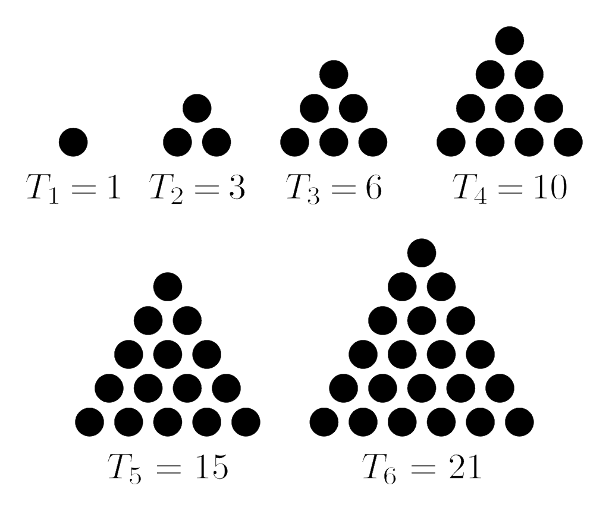

+++
title = "Project Euler 1 : Multiples of 3's and 5's"
date = 2024-04-18T11:36:42-05:00
tags = ['programming', 'math', 'euler100']
+++


# Project Euler

I first learned about [Project Euler](projecteuler.net) in graduate school around 2014. 
My first trip through some of these problems was not very far and was also in MatLab.
My aim is to visit these problems again and publish my solution, along with any others I find interesting.
As per the project's rules, I'm only allowed to publish up to the first 100 listed problems.
This earns these posts the tag of 'euler100'.

# Problem

> If we list all the natural numbers below $10$ that are multiples of $3$ or $5$, we get $3, 5, 6$ and $9$. The sum of these multiples is $23$.
Find the sum of all the multiples of $3$ or $5$ below $1000$.


Below is my initial, easy solution.


```python
# My solution

sum = 0

for n in range(1000):
    if (n%3==0) | (n%5==0):
        sum+= n

print(sum)
```

    233168
    

This solution was rated as correct. 
However, when browsing the solutions forum I did find a different approach that was more math heavy, but vastly faster.


# Triangle Numbers

Triangle numbers are numbers that count the number of elements in an equilateral triangle.

||
|:--:|
|*source: https://en.wikipedia.org/wiki/Triangular_number#/media/File:First_six_triangular_numbers.svg*|

We refer to a specific triangle such as $T^{(1)}$ by how many elements are on one side, inclusive of both contributing vertices. 
For subsequent triangles ($T^{(n)}$, $n > 1$), we can simply shave off that side, vertices included, and reveal the smaller triangle $T_{(n-1)}$.

The triangle number is the sum of those elements, $T_n$.
Just as described, in the process of shaving one side off, you can reveal the next lower count equilateral triangle.
From this we can simply add that shaved side to the previous to get the next triangle.

$$T_n = n + T_{n-1}$$
$$T_n = n + (n-1) + T_{n-2}$$
$$...$$
$$T_n = n + (n-1) + ... + 1$$

So for a triangle with a side of $5$ we get that $T_5 = 5 + 4 + 3 + 2 + 1 = 15$.
From this formulation we can derive something much more clever.

$$ T_n = n + (n-1) + (n-2) + ... + (n - n) $$
$$ T_n = n (n+1) + (-1 -2 - ... - n) $$
$$ T_n = n (n+1) - T_n $$
$$ 2 * T_n = n (n+1) $$
$$ T_n = n (n+1)/2 $$

This formulation is simple and allows us to compute a lot of small numbers on paper or even in our head.
Now, how does this help us sum multiples of $3$'s and $5$'s in any range of number?
Let's start with $3$, and also start with the range $[1,7]$, inclusive on both ends.

We can simply count this out then show the pattern. Listing all of the numbers that are multiples of 3's gives.

$$ 3 + 6 = 9 $$

Now let's do the range but for $5$'s $[1,15]$.

$$ 5 + 10 + 15 = 30$$

Obviously, every number in both is a multiple of $3$ and $5$ respectively.

$$ 3 (1 + 2) = 3 (3) $$ 
$$ --- $$
$$5 (1 + 2 + 3) = 5 (6)$$

You may notice that the sum of multiples of $3$'s in the ranges $[1,6]$, $[1,7]$, $[1,8]$ would all be the same, since neither $7$ nor $8$ are divisible by 3.
So by use of the our triangle numbers $T_n$ from above, we can develop an algorithm:

1. Figure out the largest divisible value $B$ in some range $[A, B]$ of our divisor $d$ in the given range ($floor(B/d)$).
2. Calculate the triangle number $T_n$ of that value.
3. Then multiply $T_n$ by our divisor $d$ to give our final sum.

This is shown in the python implementation below.


```python
end_number = 999


# functionize this process to use across many numbers

def sum_n_divisor(n, end_number):
    get_triangle = lambda x: x * (x+1)/2

    # double / is an integer divisor so we get the floor
    largest_divisor = end_number//n
    triangle_n = get_triangle(largest_divisor)
    sum_n_divisor = triangle_n * n

    return sum_n_divisor

divisor_3_sum = sum_n_divisor(3, end_number)
divisor_5_sum = sum_n_divisor(5, end_number)
    
print(divisor_3_sum + divisor_5_sum)


```

    266333.0
    

You might notice that this is not the answer.
$266333 > 233168$.
We have too many numbers, but you may also have already noticed that $15, 30, 45, 60...$ are both multiples of $3$ and $5$.
Our problem asks us to only count these numbers once, but I've counted it twice.
We can correct this by summing divisors of $15$ and subtracting that total out.


```python
divisor_15_sum = sum_n_divisor(15, end_number)

print(divisor_3_sum + divisor_5_sum - divisor_15_sum)
```

    233168.0
    

This is the correct answer.

The math overhead for this is much trickier, but the benefits are the speed of computation.
My original answer did it's computation in $O(n)$.
This more interesting answer does it in $O(1)$.
We also learn that if we ever need to count in sequence from zero, using a triangle number can potentially open up a lot of shortcuts.

Credit to **CatMachina** on the [projecteuler](www.projecteuler.net) board for the more interesting solution.
